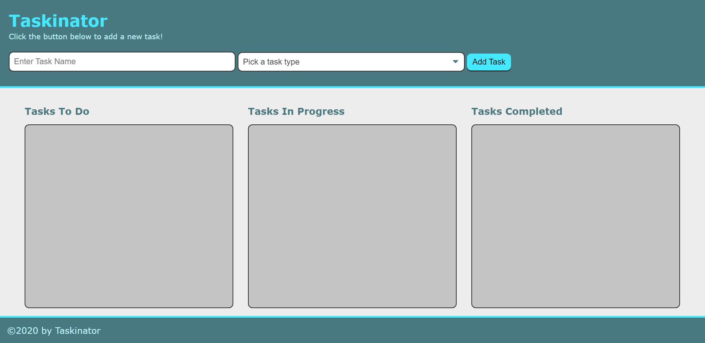

# Taskinator

- Github URL: https://github.com/DanielCConlon/Taskinator
- github pages: https://danielcconlon.github.io/Taskinator/

## Table-of-Contents

- [Description](#description)
- [Usage](#usage)
- [Application](#application)

## [Description](#description)

Taskinator is a task tracking application created following a course module using JavaScript, Web APIs and the DOM.

## [Usage](#table-of-contents)

Open the website and use input section to add a name to your task and the type of task you are doing. Use edit or delete to make modifications to your tasks, and use the drop down to change the status of your task.

## [Application](#table-of-contents)

